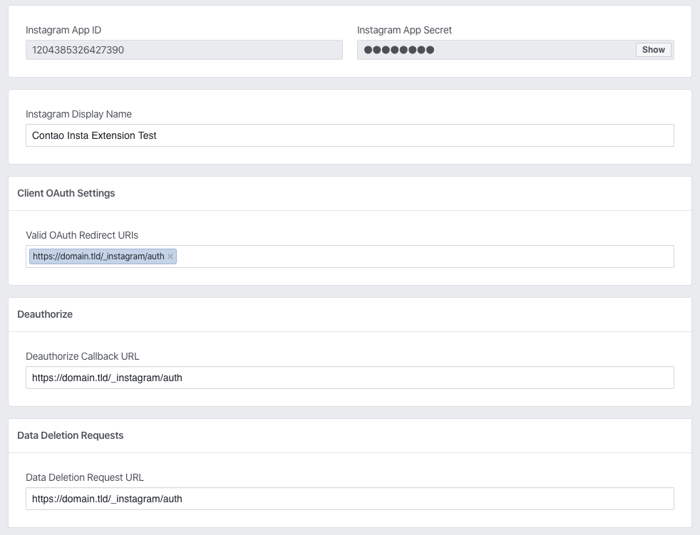
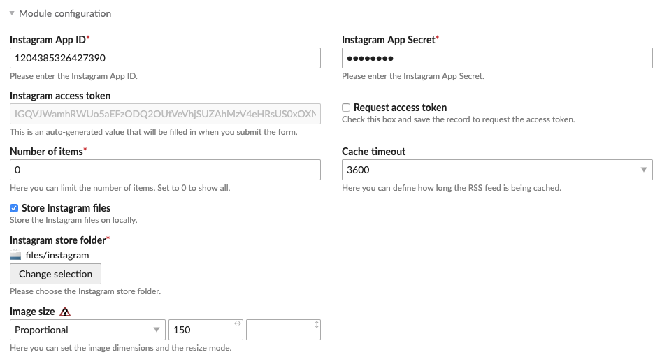
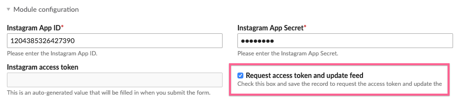

# Instagram – Documentation

## Create an Instagram app

First of all you have to create the Instagram app. Simply go to the [developer interface](https://www.instagram.com/developer/clients/manage/)
and `Register a New Client`. Fill in the necessary data and enter your domain name + `/contao/main.php` in the
`Valid redirect URIs` field.



Once the app is created, copy the *Client ID* and *Client Secret* keys to your clipboard .

### Contao 4

If you are using Contao 4, the `Valid redirect URIs` field needs to be filled with your domain name + `/contao` (_without_ `/main.php`) instead.

For example: `http://domain.tld/contao`


## Create a frontend module

Now go to the Contao backend and create the `Instagram` front end module. Fill in the necessary data and save the record.

**Note:** be sure to check the `Request access token` box!



If you have configured your app properly, you should now see the screen prompting you for the authorization.
Click the green button to authorize yourself for your app and you should be taken back to the Contao backend.



Please ensure that the `Instagram access token` is now filled in. You can now safely add the module to the page.


## Template data

The displayed template data out of box is very simple, as only the images are displayed. If you need more information,
you should check out the `$this->items` and `$this->user` variables.

You can do that by dumping the variables inside `mod_cfg_instagram.html` template:

```php
<?php $this->showTemplateVars(); ?>
```


## Data restrictions

Before you report any bugs regarding the missing Instagram feed data, be sure that you have read the official
documentation that contains information about the data you can obtain from the API:

1. https://www.instagram.com/developer/authorization/
2. https://www.instagram.com/developer/review/


## About errors

If at some point the extension does not work make sure to check the system logs.
